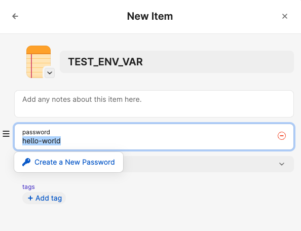

# env0

Load environment variables directly from 1Password and never use .env files again.

## Features

- Load environment variables directly from 1Password vaults
- Simple configuration using a `.env0` file to declare required envs
- Mask secrets in logs when using GitHub Actions
- Easy integration with any command or script

## Prerequisites

- [1Password CLI](https://1password.com/downloads/command-line/) installed and configured

## Installation

```bash
npm install env0
```

## Usage

#### 1. Create a `.env0` file

In your project root, add a .env0 file (this can be commited in version control) with the environment variable names that should be loaded from 1Password:

```plaintext
TEST_ENV_VAR
DB_URL
# IGNORED
```

#### 2. Create secrets in 1Password

Create a 1Password vault and add the environment variables to it:



#### 3. Run commands with env0

Use env0 to load environment variables into a sub process that runs the specified command.

```bash
# Basic usage
env0 --vault "your-vault-name" your-command

# Use a custom keys file
env0 --vault "your-vault-name" --keys "./env0.custom" your-command

# Alternatively, print environment variables for shell export
env0 --vault "your-vault-name" --print
```

## CLI Options

- `-V, --vault <name>`: Specify the 1Password vault name (required)
- `-K, --keys <path>`: Path to the keys file (default: `.env0`)
- `-P, --print`: Print environment variables for shell export
- Any additional arguments are passed to the command being executed

## How It Works

1. The CLI reads the specified keys file (default: `.env0`)
2. For each key, it fetches the corresponding item from the specified 1Password vault and returns the first field
3. Environment variables are loaded into the process environment
4. If using GitHub Actions, any 1Password password fields are automatically masked in logs
5. The specified command is executed with the loaded environment variables

## Example

```bash
# Run a Node.js application with environment variables from 1Password
env0 --vault "dev" node app.js

# Export variables to your shell and run a command
eval $(env0 --vault "dev" --print) && node app.js
```

## License

MIT License

## Contributors

- [Daniel Grant](https://github.com/djgrant)
